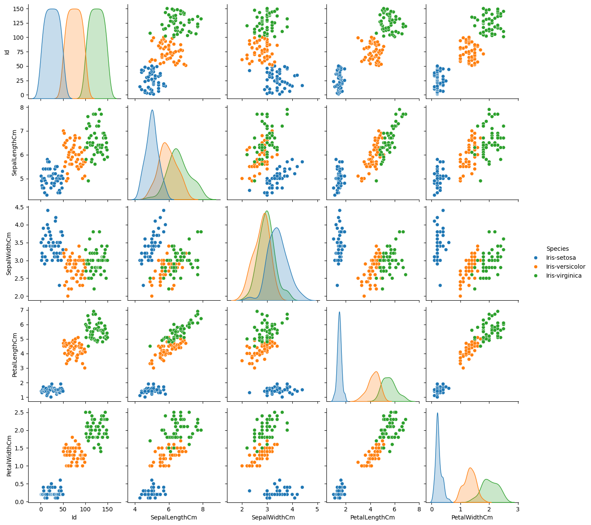
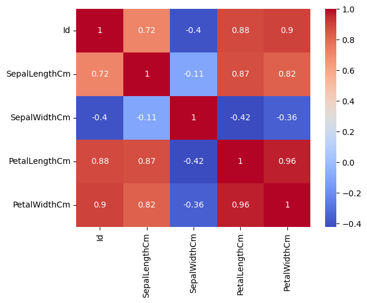
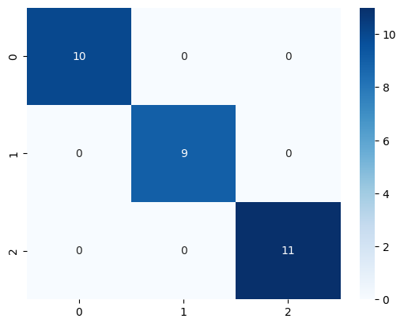

# 🌸 CodeAlpha - Iris Flower Classification

This project is developed as part of the **CodeAlpha Data Science Internship (Task 1)**.  
The goal of this task is to build a **machine learning model** that can classify Iris flower species based on their sepal and petal measurements.


# 🧠 Project Overview

The **Iris dataset** contains 150 samples of iris flowers from three species:

- *Iris-setosa*  
- *Iris-versicolor*  
- *Iris-virginica*

Each flower is described by four numerical features:
- Sepal Length  
- Sepal Width  
- Petal Length  
- Petal Width  

The objective is to train a model that predicts the correct species from these measurements.


## 🧰 Tools & Libraries Used

- **Python 3**
- **NumPy**
- **Pandas**
- **Matplotlib**
- **Seaborn**
- **Scikit-learn**

---

## 📊 Steps Performed

1. **Data Loading & Cleaning** – Imported the dataset (`Iris.csv`) and checked for missing values.  
2. **Exploratory Data Analysis (EDA)** – Visualized pair plots and feature correlations.  
3. **Data Preprocessing** – Split dataset into training (80%) and testing (20%) sets and applied feature scaling.  
4. **Model Building** – Trained a **Support Vector Machine (SVM)** classifier.  
5. **Model Evaluation** – Measured accuracy, precision, recall, and F1-score; plotted the confusion matrix.  
6. **Model Saving** – Saved the trained model as `iris_model.pkl` for future predictions.

---

## 📈 Results

| Metric | Value |
|--------|--------|
| **Accuracy** | ~97 – 99 % |
| **Algorithm** | Support Vector Machine (RBF kernel) |
| **Dataset Size** | 150 samples |


The model achieved excellent accuracy on the test data, clearly distinguishing among all three Iris species.

## 🖼️ Output Images

### Pair Plot


### Feature Correlation Heatmap


### Confusion Matrix



## 🧩 How to Run the Project

1. Clone the repository  
   ```bash
   git clone https://github.com/yourusername/CodeAlpha_IrisClassification.git
   cd CodeAlpha_IrisClassification

   pip install pandas numpy matplotlib seaborn scikit-learn joblib

   jupyter notebook CodeAlpha_IrisClassification.ipynb
   ```

Dataset link
   https://www.kaggle.com/datasets/saurabh00007/iriscsv

---

## 📂 Project Structure

```text
CodeAlpha_IrisClassification_DataScience/
├── CodeAlpha_IrisClassification.ipynb
├── Iris.csv
├── README.md
├── iris_model.pkl
├── output.png
├── output1.png
└── output3.png
```
